# DSBs github CI/CD actions
Collection of DSB custom github actions for CI/CD.

## File index
```
ci-cd/
├───build-docker-image              --> Build, tag and push docker image
├───build-maven-project             --> Configure Java and build maven project
├───build-nodejs-project            --> Configure Node.js and build node project
├───build-python-project            --> Configure Python and build python project
├───build-spring-boot-image         --> Build spring boot OCI image with labels and tags
├───collect-build-envs              --> Collect build output from previous steps stored as workflow artifacts
├───comment-on-pr                   --> Add/update PR comment
├───configure-maven-settings        --> Create maven user settings (settings.xml)
├───create-app-vars-matrix          --> Create build/deploy vars for one or more DSB apps
├───create-build-envs               --> Create common DSB CI/CD variables
├───delete-pr-images-from-acr       --> Delete ephemeral PR image repository from ACR
├───deploy-to-ephemeral             --> Deploy DSB app to ephemeral environment
├───deploy-to-static                --> Deploy DSB app to static environment
├───notify-internal-status          --> Send status update to internal API
├───prune-images-from-acr           --> Prune images from ACR
├───prune-maven-artifacts-in-repo   --> Prune maven artifacts from GitHub packages
├───require-build-envs              --> Test DSB build environment variables for non-zero values
└───teardown-pr-environment         --> Tear down ephemeral PR environment in AKS
```

## Usage and doc

These actions are used by the CI/CD workflow(s) in [./workflows](../workflows). For example usage see their usage in those workflows.

For documentation refer to the `description` section of each specific actions as well as comments within their definition.

### Permissions

The calling workflow must grant the following permissions:

```yaml
permissions:
  contents: read        # required for actions/checkout
  pull-requests: write  # required for commenting on PRs
  actions: write        # required to be able to delete GitHub caches in the calling repo
  checks: write         # required for publish-unit-test-result-action
  packages: write       # required for maven deploy to GitHub Packages
  id-token: write       # required for GitHub artifact attestation (OIDC token)
  attestations: write   # required for writing build provenance attestations
```

Alternatively, `permissions: write-all` can be used as a shorthand which covers all of the above.

### Artifact attestation

Build provenance and SBOM attestations are automatically created using [`actions/attest`](https://github.com/actions/attest):

- **Docker images** (via `build-docker-image` and `build-spring-boot-image`) — build provenance attestation is pushed to the container registry as an OCI referrer. If an SBOM is provided by the upstream build step, a CycloneDX SBOM attestation is also pushed to the registry.
- **Maven artifacts** (via `build-maven-project`) — build provenance and CycloneDX SBOM attestations are stored on GitHub's attestation API, linked to the artifact's SHA-256 digest. The SBOM is also passed to the downstream Docker image build for image-level attestation.
- **npm projects** (via `build-nodejs-project`) — a CycloneDX SBOM is generated and passed to the downstream Docker image build, where it is attested against the image digest.

Attestations are created for both PR/snapshot and release builds.

#### Verification

```bash
# Docker images — build provenance
gh attestation verify oci://<registry>/<repo>/<image>:<tag> --owner dsb-norge

# Docker images — SBOM
gh attestation verify oci://<registry>/<repo>/<image>:<tag> --owner dsb-norge --predicate-type "https://cyclonedx.org/bom"

# Maven artifacts (downloaded from GitHub Packages)
gh attestation verify <artifact.jar> --owner dsb-norge
```

#### Self-hosted runner network requirements

Artifact attestation requires outbound HTTPS (443) access to Sigstore endpoints from the runner. These are not documented by GitHub but are defined in the [`@actions/attest` source code](https://github.com/actions/toolkit/blob/main/packages/attest/src/endpoints.ts):

| Endpoint | Purpose |
|----------|---------|
| `fulcio.githubapp.com` | Signing certificate issuance (private repos) |
| `timestamp.githubapp.com` | Timestamp authority (private repos) |
| `fulcio.sigstore.dev` | Signing certificate issuance (public repos) |
| `rekor.sigstore.dev` | Transparency log (public repos) |

## Maintenance

### Development

How you test changes before merging depends on what you've touched. In both cases the caller repo's workflow points at your **branch name** (not a tag) so each new commit you push is automatically picked up on the next CI run.

#### Scenario A: workflow-only changes (`.github/workflows/*.yml`)

If your change only touches the reusable workflows themselves and not the underlying `ci-cd/*` actions, no rewriting is needed inside this repo.

1. Push your changes to a feature branch (e.g. `my-feature-branch`).
2. In the calling repo, change the `uses:` ref of the reusable workflow from `@v4` to your branch name:

   ```yaml
   jobs:
     ci-cd:
       # TODO revert to '@v4'
       uses: dsb-norge/github-actions/.github/workflows/ci-cd-default.yml@my-feature-branch
   ```
3. Push the change in the calling repo and let CI run. Iterate by pushing new commits on your feature branch — the next CI run in the calling repo picks them up automatically.
4. Before merging your PR here, the calling repo reverts `@my-feature-branch` back to `@v4`.

#### Scenario B: changes that also touch `ci-cd/*` actions or `get-github-app-installation-token`

The reusable workflows' internal `uses: dsb-norge/github-actions/ci-cd/*@v4` references will still resolve to the **stable `@v4`** tag — so your action changes won't be picked up by callers unless you also rewrite those internal refs in your branch.

1. In your branch, rewrite every internal `@v4` ref to point at your branch name. Replace regex pattern for VSCode:
   - Find: `(^\s*)((- ){0,1}uses: dsb-norge/github-actions/.*@)v4`
   - Replace: `$1# TODO revert to @v4\n$1$2my-feature-branch`
2. Commit and push.
3. Point the calling repo at your branch name (as in Scenario A) and iterate.
4. **Before merging**, revert all internal `@my-feature-branch` refs back to `@v4`. Replace regex pattern for VSCode:
   - Find: `(^\s*# TODO revert to @v4\n)(^\s*)((- )?uses: dsb-norge/github-actions/.*@)my-feature-branch`
   - Replace: `$2$3v4`

#### Optional: pin to a movable tag instead of a branch

For scenarios where you want snapshot semantics — multiple people testing the same commit simultaneously, or freezing your test target while you iterate on something else — create a movable tag and reference `@my-feature` in place of the branch name:

```bash
git tag -f -a 'my-feature'
git push -f origin 'refs/tags/my-feature'
```

Move the tag with the same commands after each new commit. Delete when done:

```bash
git tag --delete 'my-feature'
git push --delete origin 'my-feature'
```

For solo iterative testing, branch-pinning is enough.

### Release

After merge to main use tags to release.

#### Minor release

Ex. for smaller backwards compatible changes. Add a new minor version tag (e.g. `v4.5`) with a description of the changes and amend the description to the major version tag.

Example for release `v4.5`:
```bash
git checkout origin/main
git pull origin main
# review latest release tag to determine which is the next one
git tag --sort=-creatordate | head -n 5
# output changes since last release
git log v4..HEAD --pretty=format:"%s"
git tag -a 'v4.5'
# you are prompted for the tag annotation (change description)
git tag -f -a 'v4'
# you are prompted for the tag annotation, amend the change description
git push -f origin 'refs/tags/v4.5'
git push -f origin 'refs/tags/v4'
```

**Note:** If you are having problems pulling main after a release, try to force fetch the tags: `git fetch --tags -f`.

#### Major release

Same as minor release except that the major version tag is a new one. I.e. we do not need to force tag/push.

Example for release `v5`:
```bash
git checkout origin/main
git pull origin main
# review latest release tag to determine which is the next one
git tag --sort=-creatordate | head -n 5
# output changes since last release
git log v4..HEAD --pretty=format:"%s"
git tag -a 'v5.0'
# you are prompted for the tag annotation (change description)
git tag -a 'v5'
# you are prompted for the tag annotation
git push -f origin 'refs/tags/v5.0'
git push -f origin 'refs/tags/v5'
```

**Note:** If you are having problems pulling main after a release, try to force fetch the tags: `git fetch --tags -f`.


#### Un-release (move major tag back)

In case of trouble where a fix takes long time to develop, this is how to rollback the major tag to the previous minor release.

Example un-release `v4.5` and revert to `v4.4`:
```bash
git checkout origin/main
git pull origin main

moveTag='v4'
moveToTag='v4.4'
moveToHash=$(git rev-parse --verify ${moveToTag})

git push origin "refs/tags/${moveTag}"      # delete the old tag remotely
git tag -fa ${moveTag} ${moveToHash}        # move tag locally
git push -f origin "refs/tags/${moveTag}"   # push the updated tag remotely

```

**Note:** If you are having problems pulling main after a release, try to force fetch the tags: `git fetch --tags -f`.

## CI/CD Workflow Diagram

The following flowchart visualizes the entire CI/CD pipeline, showing all major steps and their dependencies:

```mermaid
flowchart TD
    %% Start
    start([Start Workflow])

    %% Create matrix job
    subgraph createMatrixJob["Create Build Matrix Job (create-matrix)"]
        createMatrix["create-app-vars-matrix"]
        matrixOutput(("App Vars Matrix"))
        createMatrix --> matrixOutput
    end

    %% Build-deploy job (matrix)
    subgraph buildDeployJob["Build-Deploy Job (Matrix) (build-deploy)"]
        getToken["get-github-app-installation-token"]
        createEnvs["create-build-envs"]
        buildEnvsOutput(("Build Envs"))
        cacheRestore["dependencies-cache-restore"]
        appTypeCheck{App Type?}
        mavenBuild["build-maven-project"]
        mavenDockerBuild["build-spring-boot-image"]
        npmBuild["build-nodejs-project"]
        npmDockerBuild["build-docker-image"]
        cacheSave["Save Dependencies Cache"]
        eventTypeCheck{Event Type?}
        ephemeralDeploy["deploy-to-ephemeral"]
        teardownPR["teardown-pr-environment"]
        pruneImages["prune-images-from-acr"]
        deletePRImages["delete-pr-images-from-acr"]
        deletePRCaches["delete-pr-github-caches"]

        getToken --> createEnvs --> buildEnvsOutput --> cacheRestore --> appTypeCheck
        appTypeCheck -- "spring-boot" --> mavenBuild --> mavenDockerBuild
        appTypeCheck -- "vue" --> npmBuild --> npmDockerBuild
        mavenDockerBuild --> cacheSave
        npmDockerBuild --> cacheSave
        cacheSave --> eventTypeCheck
        eventTypeCheck -- "PR" --> ephemeralDeploy
        eventTypeCheck -- "PR closed" --> teardownPR --> deletePRImages --> deletePRCaches
        eventTypeCheck -- "push/manual" --> pruneImages
    end

    %% AND join node for jobs that require both createMatrixJob and buildDeployJob
    andDeployStatic["<b>Waits for both jobs</b>"]
    andPruneMaven["<b>Waits for both jobs</b>"]

    %% Deploy to static job
    subgraph deployStaticJob["Deploy to Static Job (deploy-to-static)"]
        collectEnvs["collect-build-envs"]
        deployCheck["deploy-multiple-to-static-is-allowed"]
        getTokenStatic["get-github-app-installation-token"]
        staticDeploy["deploy-multiple-to-static"]
        versionTag["Add Git Version Tag"]
        collectEnvs --> deployCheck -- "allowed" --> getTokenStatic --> staticDeploy --> versionTag
    end

    %% Prune Maven artifacts job
    subgraph pruneMavenJob["Prune Maven Artifacts Job (prune-maven-artifacts)"]
        pruneArtifacts["prune-maven-artifacts-in-repo"]
    end

    %% Final conclusion
    conclusion([CI/CD Conclusion])

    %% Job dependencies (needs)
    start --> createMatrixJob
    matrixOutput -.-> buildDeployJob
    createMatrixJob --|waits on|--> andDeployStatic
    buildDeployJob --|waits on|--> andDeployStatic
    andDeployStatic --> deployStaticJob
    createMatrixJob --|waits on|--> andPruneMaven
    buildDeployJob --|waits on|--> andPruneMaven
    andPruneMaven --> pruneMavenJob
    deployStaticJob --> conclusion
    pruneMavenJob --> conclusion
    buildDeployJob --> conclusion

    %% Notes
    %% - The AND nodes visually clarify that deployStaticJob and pruneMavenJob only start after both upstream jobs finish
    %% - Arrow labels and dummy nodes are used to clarify 'waits on' semantics
```



This diagram now uses labeled arrows and explicit AND nodes to clarify that jobs like "deploy-to-static" and "prune-maven-artifacts" only start after both upstream jobs are complete. Box labels have also been adjusted for better visibility.
